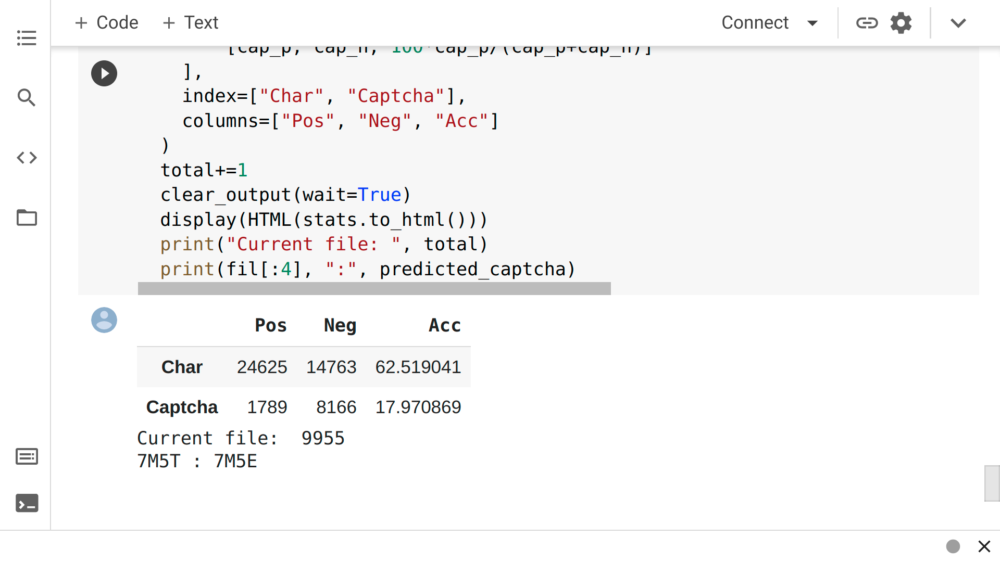
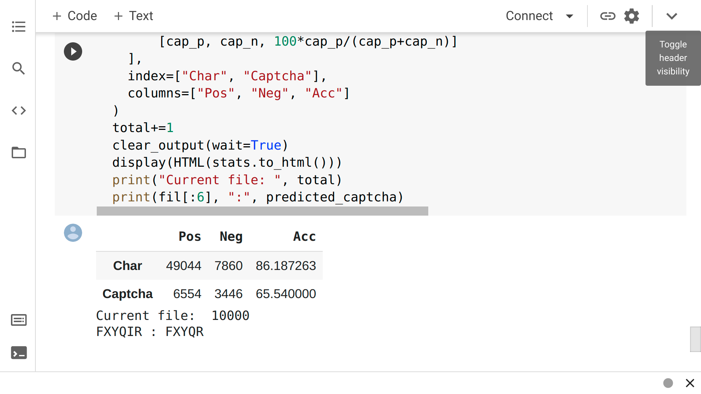

# Results

## CNN model for generated captchas with **chars74K**

## CNN model for **rdmpage** dataset with **chars74K**

## CNN model for generated captchas with generated dataset

# Datasets

## [captcha-breakers/D-training-segmentation](https://github.com/captcha-breakers/D-training-segmentation)

## [captcha-breakers/D-captchas-simple-uppercase](https://github.com/captcha-breakers/D-captchas-simple-uppercase)

## [captcha-breakers/D-captchas-pycaptcha](https://github.com/captcha-breakers/D-captchas-pycaptcha)
